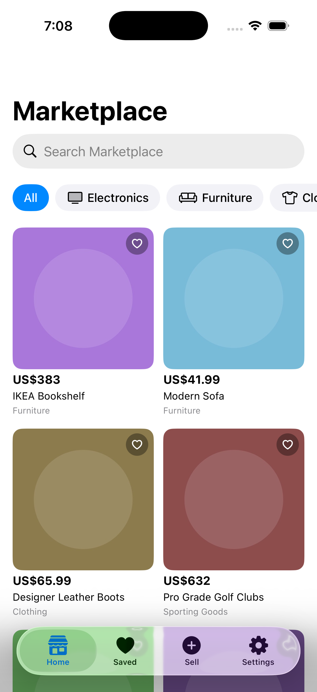

# Rogers Marketplace — Offline-First Marketplace

A small, production-minded iOS marketplace app: browse listings, save
favorites, and create new listings — all fully offline — with automatic
background sync once connectivity returns. Built with Swift, SwiftUI, and
SwiftData only; **no third-party libraries**.

<p>
  
</p>

## Contents

- [Quick start](#quick-start)
- [Architecture](#architecture) (component diagram in [docs/ARCHITECTURE.md](docs/ARCHITECTURE.md), sequence diagrams in [docs/SEQUENCE.md](docs/SEQUENCE.md))
- [Running on a physical device](#running-on-a-physical-device)
- [Testing](#testing)
- [Performance & resource usage](#performance--resource-usage)
- [Security](#security)
- [Known limitations & trade-offs](#known-limitations--trade-offs)
- [Engineering standards](docs/ENGINEERING_STANDARDS.md)

## Quick start

Requirements: Xcode 26+, a Mac with Node.js installed (any recent LTS).

```bash
# 1. Start the mock API (generates 200 seed listings + placeholder images
#    on first run, then serves them via JSON Server on localhost:3000)
./scripts/setup.sh

# 2. In another terminal (or from Xcode), open and run the app
open "Rogers-Marketplace Assignment.xcodeproj"
```

Build and run on any iOS 26 Simulator. The app defaults to
`http://localhost:3000` as its API base URL, which resolves correctly from
the Simulator (it shares the Mac's network stack).

To regenerate the mock data from scratch: `./scripts/setup.sh --reseed`.

## Architecture

MVVM + Repository, with a protocol-first `Domain` layer that has zero
dependency on SwiftData, URLSession, or SwiftUI — every `Data` implementation
(persistence, networking, images, sync) is swapped in at the composition
root (`App/AppDependencies.swift`) and consumed through protocols. This is
what makes the business logic (conflict resolution, validation, sync
orchestration) unit-testable without touching a simulator.

```
Presentation (SwiftUI, @Observable ViewModels)
      ↓ depends on
Domain (pure Swift: Listing, ConflictResolver, ListingValidator, protocols)
      ↑ implemented by
Data (SwiftData persistence, URLSession networking, image cache, sync engine)
```

See **[docs/ARCHITECTURE.md](docs/ARCHITECTURE.md)** for the full component
diagram, and **[docs/SEQUENCE.md](docs/SEQUENCE.md)** for
four sequence diagrams covering: offline create → reconnect → sync,
cache-first image loading, conflict resolution, and background upload.

### Offline-first sync

- SwiftData is the **only** source of truth the UI ever reads from. The
  network exists purely to feed the local store.
- Every offline create/edit is written to an **outbox** (`PendingChangeEntity`)
  alongside the local `ListingEntity`. `SyncEngine` drains this outbox FIFO
  once `NWPathMonitor` reports connectivity, then pulls the server's list and
  reconciles.
- **Conflict resolution** is a pure, independently-tested function
  (`ConflictResolver`) with two strategies the user picks in **Settings**:
  - **Last-Write-Wins** — whichever side's `updatedAt` is newer wins outright.
  - **Field-Merge** — locally-edited fields are kept; every other field takes
    the server's value.
- Sync status (`idle` / `offline` / `syncing` / `synced` / `failed`) streams
  to the UI via `AsyncStream` and shows as a banner at the top of the feed.

### Images

Images are downsampled with ImageIO (`CGImageSourceCreateThumbnailAtIndex`)
directly to the pixel size the grid cell needs — never a full-resolution
decode — then cached in a cost-limited `NSCache` (memory) backed by a disk
cache under `Caches/` (survives relaunch, evictable by the OS under storage
pressure). See [Performance](#performance--resource-usage) below.

JSON Server has no multipart upload endpoint, so photos are downsampled and
embedded as base64 `data:` URLs directly in a listing's `imageURLs` at
creation time, then travel as part of the normal JSON create/update request
— both in the foreground (`APIClient`) and in the background
(`BackgroundUploader`, via a real background `URLSession` upload task). A
production backend would swap this for presigned-URL or multipart uploads
without changing anything above the network layer.

## Running on a physical device

The Simulator shares your Mac's network stack, so `localhost:3000` just
works. A physical device is on its own network interface and needs your
Mac's LAN IP instead:

1. Make sure your iPhone and Mac are on the **same Wi-Fi network**.
2. Run `./scripts/setup.sh` — it prints your Mac's LAN IP (e.g.
   `http://10.0.0.42:3000`).
3. In the app, go to **Settings → Mock API Server**, enter that URL, and
   tap **Save Server URL**.
4. Pull to refresh on the Home tab, or tap **Sync Now** in Settings.

The app's `Info.plist` scopes an App Transport Security exception to local
networking only (`NSAllowsLocalNetworking`) rather than disabling ATS
outright, plus the `NSLocalNetworkUsageDescription` string iOS requires
before it will let the app probe your LAN.

## Testing

```bash
xcodebuild test \
  -scheme "Rogers-Marketplace Assignment" \
  -project "Rogers-Marketplace Assignment.xcodeproj" \
  -destination "platform=iOS Simulator,name=iPhone 17"
```

77 Swift Testing cases across 8 suites, all pure/fast — no network, no
Simulator UI, in-memory SwiftData containers only:

| Suite | Covers |
|---|---|
| `ConflictResolverTests` | LWW + field-merge, both directions, favorite preservation |
| `ListingValidatorTests` | Title/description/price/image-count validation, price parsing edge cases |
| `SyncEngineTests` | Offline detection, FIFO outbox drain, retry-on-failure, conflict reconciliation, status stream |
| `ListingRepositoryTests` | Create/update/favorite semantics, outbox coalescing, search/category/favorites filtering |
| `APIClientTests` | Request shape, auth header, 4xx/5xx mapping, malformed-JSON handling, relative image URL resolution |
| `ImageCacheTests` / `ThumbnailGeneratorTests` | Memory/disk cache hits avoid re-fetching, downsample bounds, no-upsample |
| `KeychainStoreTests` | Set/get/delete/overwrite round-trips |
| `MapperTests` | `Listing` ⇄ `ListingEntity` ⇄ `ListingRecord` round-trips, Decimal precision |

## Performance & resource usage

Demonstrated smooth handling of **200 listings**:

- **Memory**: `LazyVGrid` only materializes visible cells. Each thumbnail is
  decoded once, at exactly the pixel size the cell needs (point size ×
  display scale) — a 200-listing grid never holds 200 full-resolution
  decoded images in memory, only what's on/near screen plus whatever the
  50 MB `NSCache` cost budget retains.
- **CPU**: ImageIO's thumbnail path decodes directly at target size instead
  of decode-then-downscale, which is both faster and avoids the transient
  memory spike of a full decode. Search/category filtering is debounced
  (250 ms) so typing doesn't trigger a fetch per keystroke.
- **Disk**: thumbnails persist in `Caches/` (not `Documents`), keyed by a
  SHA-256 hash of `url + pixel-size` — content-addressed, so the OS can
  purge it under storage pressure without breaking anything; it just
  refetches.
- **Network**: sync batches all pending changes into one drain pass, then
  one pull — not one request per screen. `NWPathMonitor` runs on a private
  background queue, never polling.

## Security

- The mock API token lives in the **Keychain** (`KeychainStore`), not
  `UserDefaults` — even though JSON Server itself doesn't check it, the
  `Authorization: Bearer …` header is genuinely sent on every request, so
  the secure-storage path is exercised for real.
- All listing input is validated in the `Domain` layer (`ListingValidator`)
  before it ever reaches persistence — length bounds, non-empty checks,
  strict decimal price parsing that rejects ambiguous separators, image
  count caps.
- The server URL entered in Settings is validated (scheme + host present)
  before being persisted or used.
- No force-unwraps in `Data`/`Domain` code outside of well-understood
  invariants (e.g. a `JSONEncoder` call on a type whose `Codable`
  conformance is hand-verified).

## Known limitations & trade-offs

These are deliberate scope cuts for a take-home project, not oversights —
each is also called out at its point of use in the code or in
[docs/ARCHITECTURE.md](docs/ARCHITECTURE.md)'s decision table:

- **Favorites are local-only.** JSON Server has no concept of a user, so
  there's nothing meaningful to sync a favorite flag *to*. Conflict
  resolution always preserves the local favorite value regardless of
  strategy.
- **Images travel as embedded base64, not multipart.** See
  [Images](#images) above.
- **`BGProcessingTask` launches are opportunistic and rarely fire on the
  Simulator.** The background upload path is real (genuine background
  `URLSession`, `uploadTask(fromFile:)`, `BGTaskScheduler` registration —
  see sequence diagram 4 in [docs/SEQUENCE.md](docs/SEQUENCE.md)),
  but exercising it end-to-end needs a physical
  device or the Xcode debugger's task-simulation console command (documented
  inline in `BackgroundTaskCoordinator`). Foreground sync (triggered on
  launch and on every offline→online transition) covers the common path.
- **No pagination.** 200 listings fit comfortably in memory as lightweight
  value types; a larger catalog would need `FetchDescriptor` paging, which
  the repository's query shape (`ListingQuery`) is already structured to
  accommodate.
