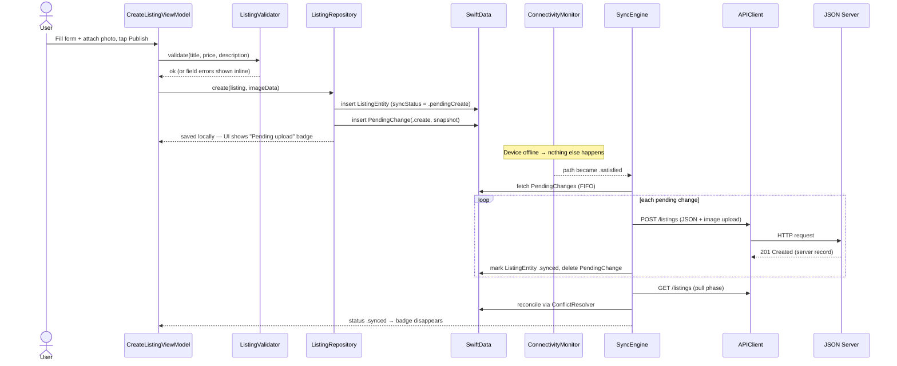
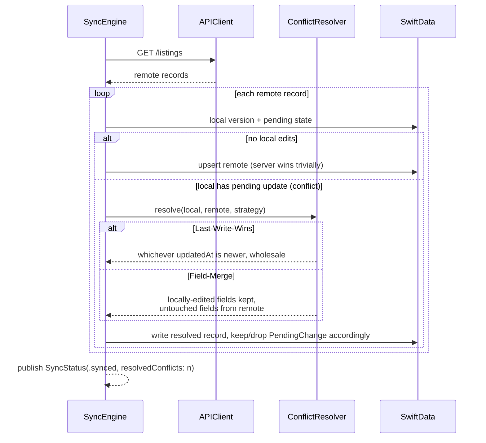

# Sequence Diagrams

Companion to [ARCHITECTURE.md](ARCHITECTURE.md), which covers the static
component structure and layering rules. These four diagrams cover the
dynamic flows that matter most for an offline-first app: writing while
offline, browsing efficiently, reconciling conflicts, and uploading in the
background.

## 1. Offline create → reconnect → sync



## 2. Browse with cache-first images (200 listings)

```mermaid
sequenceDiagram
    participant Grid as HomeView (LazyVGrid)
    participant VM as HomeViewModel
    participant Repo as ListingRepository
    participant DB as SwiftData
    participant IC as ImageCache (NSCache)
    participant Disk as ImageStore (disk)
    participant TG as ThumbnailGenerator
    participant JS as JSON Server

    Grid->>VM: onAppear
    VM->>Repo: observeListings(query)
    Repo->>DB: FetchDescriptor (sorted, indexed)
    DB-->>Grid: 200 rows render instantly (offline OK)
    par per visible cell
        Grid->>IC: thumbnail(for: url, size: cellSize)
        alt memory hit
            IC-->>Grid: UIImage (no decode)
        else disk hit
            IC->>Disk: read file
            Disk->>TG: downsample to cellSize·scale (ImageIO, no full decode)
            TG-->>IC: thumbnail → cache w/ byte cost
        else miss
            IC->>JS: GET /images/xyz.jpg
            JS-->>Disk: write original to disk
            Disk->>TG: downsample
            TG-->>IC: thumbnail → cache
        end
    end
    Note over IC: memory warning → NSCache evicts;<br/>disk survives for next launch
```

## 3. Conflict resolution during pull (both strategies)



## 4. Background image upload when connectivity returns (app backgrounded)

```mermaid
sequenceDiagram
    participant OS as iOS (BGTaskScheduler)
    participant Coord as BackgroundTaskCoordinator
    participant Net as ConnectivityMonitor
    participant Sync as SyncEngine
    participant Up as BackgroundUploader<br/>(background URLSession)
    participant JS as JSON Server

    Note over Coord: App enters background with<br/>pending changes → schedule BGProcessingTask<br/>(requiresNetworkConnectivity = true)
    OS-->>Coord: launch task when network available
    Coord->>Net: confirm path .satisfied
    Coord->>Sync: drainOutbox()
    Sync->>Up: upload image files (uploadTask from file URL)
    Up->>JS: POST multipart/body per image
    JS-->>Up: 201 Created
    Note over Up: background URLSession survives<br/>suspension; delegate fires on completion
    Up-->>Sync: uploads complete
    Sync->>JS: POST/PATCH listing JSON
    Sync-->>Coord: outbox empty → setTaskCompleted(success: true)
    Note over Coord: reschedule if work remains<br/>or task expired (expirationHandler)
```
